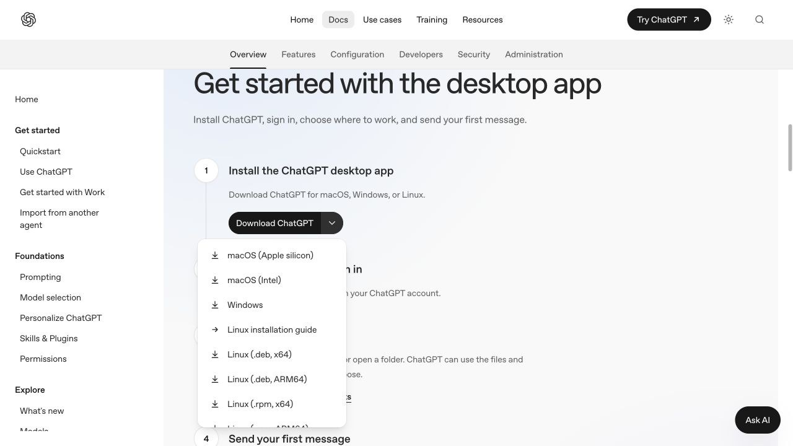
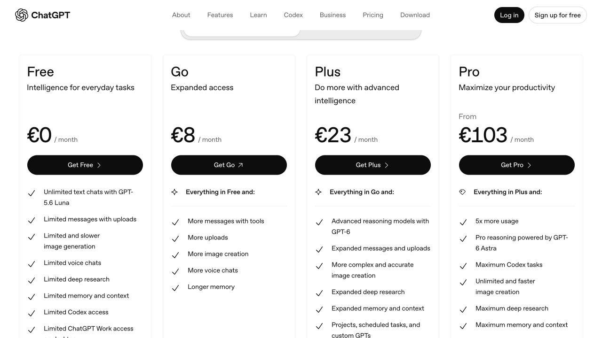
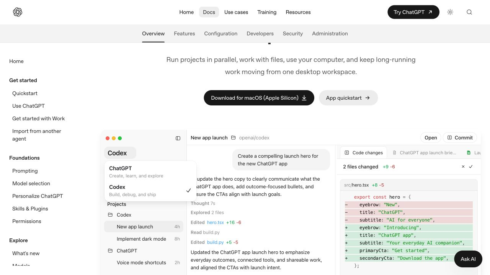
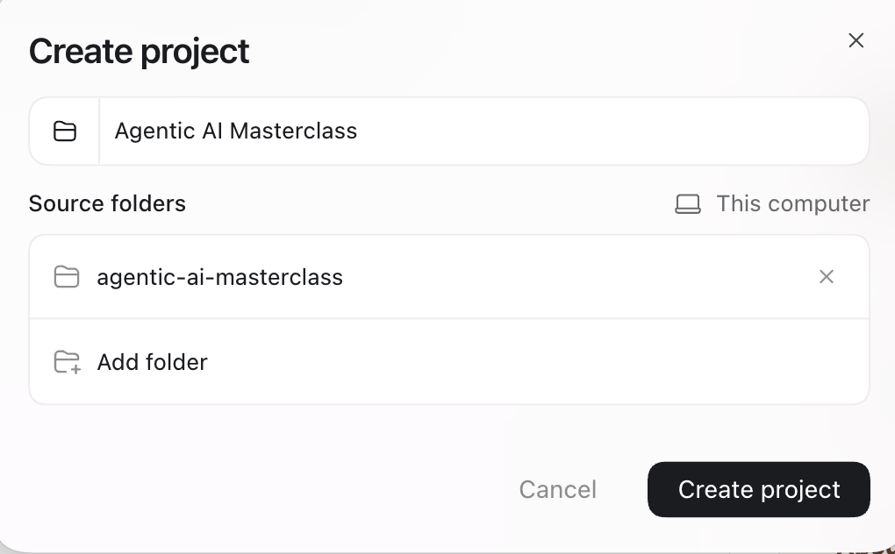

# Get ready for the masterclass

Four steps. Once the app is open, Codex can help with the rest.

<section class="setup-step" aria-labelledby="download-chatgpt" markdown="1">

## 1. Download ChatGPT {#download-chatgpt}

Choose your computer:

<a class="button" href="https://get.microsoft.com/installer/download/9PLM9XGG6VKS?cid=website_cta_psi">Windows ↓</a>
<a class="button secondary" href="https://persistent.oaistatic.com/codex-app-prod/Codex.dmg">Mac · Apple Silicon ↓</a>
<a class="button secondary" href="https://persistent.oaistatic.com/codex-app-prod/Codex-latest-x64.dmg">Mac · Intel ↓</a>

**Windows:** open the download and follow **Install**. **Mac:** open the `.dmg` and copy the app into **Home → Applications** (create that folder if needed).

Open ChatGPT and sign in. On a Mac, **Apple menu → About This Mac** tells you which chip you have.

<figure class="setup-shot"><figcaption>On the <a href="https://learn.chatgpt.com/docs/app#getting-started">download page</a>, click the arrow, then your operating system. Click any screenshot to enlarge.</figcaption></figure>
</section>

<section class="setup-step" aria-labelledby="get-plus" markdown="1">

## 2. Get ChatGPT Plus {#get-plus}

<a class="button" href="https://chatgpt.com/pricing/">Purchase Plus here ↗</a>

Click **Get Plus**, sign in, and complete checkout. Already have Plus or Pro? Skip this step.

<aside class="reimbursement" markdown="1">
**Want reimbursement for one month from AI Realist?**

Email your **receipt** and **bank transfer details** (account holder, IBAN, and BIC/SWIFT if needed) to **[hello@airealist.org](mailto:hello@airealist.org?subject=Masterclass%20%E2%80%94%20ChatGPT%20Plus%20reimbursement)**.

</aside>

<figure class="setup-shot compact"><figcaption>Choose <strong>Get Plus</strong>. The price shown at your checkout applies.</figcaption></figure>
</section>

<section class="setup-step" aria-labelledby="open-workspace" markdown="1">

## 3. Open your workspace {#open-workspace}

The starter kit is the folder you extracted.

1. **Unzip it:** double-click on Mac; right-click → **Extract All** on Windows.
2. In ChatGPT, open the top-left product menu and choose **Codex**.
3. Open **Projects** and create a project named **Agentic AI Masterclass**.
4. Click **Add folder**, choose the extracted **agentic-ai-masterclass** folder, then click **Create project**.

<figure class="setup-shot compact"><figcaption>Choose <strong>Codex</strong> from the top-left menu. Screenshot of <a href="https://learn.chatgpt.com/docs/app">OpenAI’s interactive app example</a>.</figcaption></figure>
<figure class="setup-shot" style="grid-column:1 / -1;max-width:760px;width:100%;justify-self:center"><figcaption>Name your project, add the extracted folder, then click <strong>Create project</strong>.</figcaption></figure>
</section>

<section class="setup-step setup-last" aria-labelledby="finish-setup" markdown="1">

## 4. Let Codex finish the setup {#finish-setup}

Start a **New chat** in your project. Copy this message, paste it, and press **Send**:

Use $masterclass-setup. Check my computer and this workspace. Install or update Python 3.14.7, Node 26.10.0, Poetry and Git in my user account, without admin rights. Preserve existing work. Install the locked Python dependencies, create my local .env, run the setup check and open the preview. Then help me get the starter repository with Git.

<button class="button" type="button" data-copy="installation-prompt">Copy setup message</button>

Create a [free GitHub account](https://github.com/signup), then [get the starter repository](teamwork.md). This is the last setup step. Groups come later.

**Done when:** the check passes, you see **“Your workspace is running,”** and the cloned starter repository is open in Codex.

</section>

Need help? [Let Codex install the tools](setup-technical.md) · [Troubleshooting](troubleshooting.md) · [Get the starter with Git](teamwork.md) · [Agent settings](agent-practices.md)

If your work laptop blocks installation, email [hello@airealist.org](mailto:hello@airealist.org) before the workshop.

Screenshots from OpenAI’s public pages and the desktop app, 23 September 2026. Button labels may change. <a href="https://learn.chatgpt.com/docs/projects">Project help</a>.

