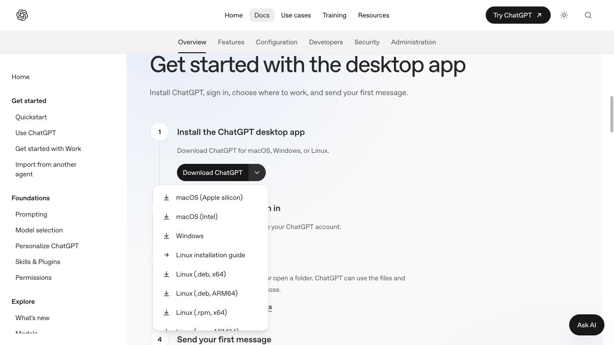
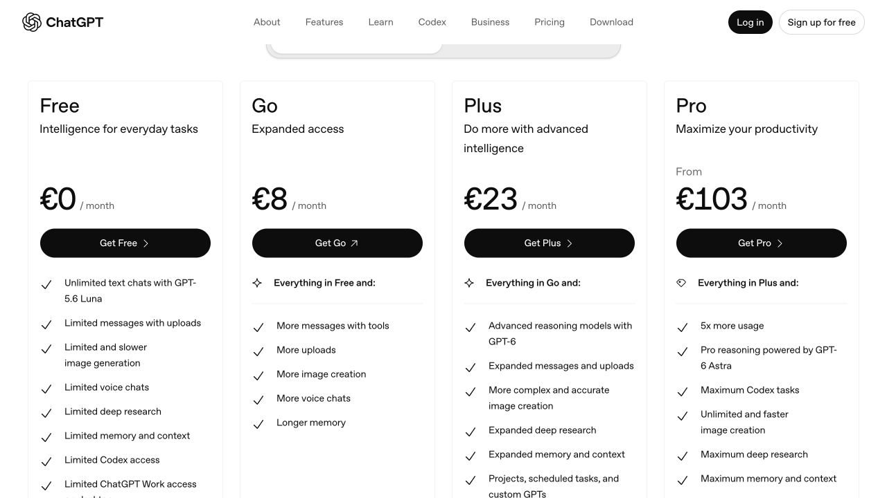
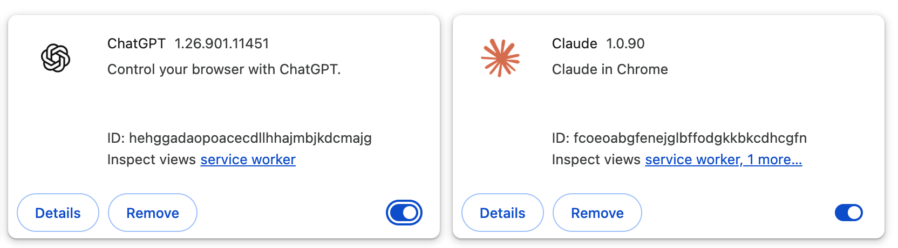
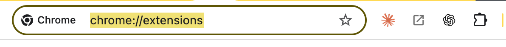
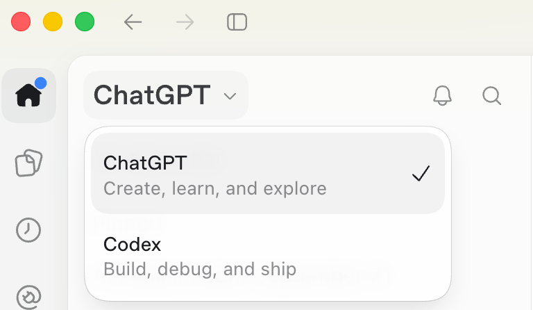
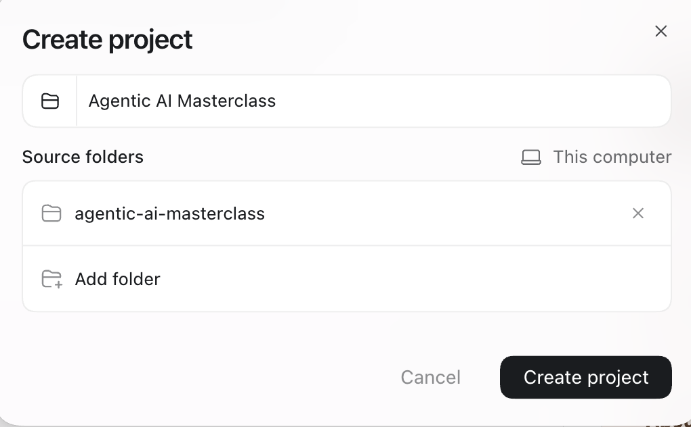
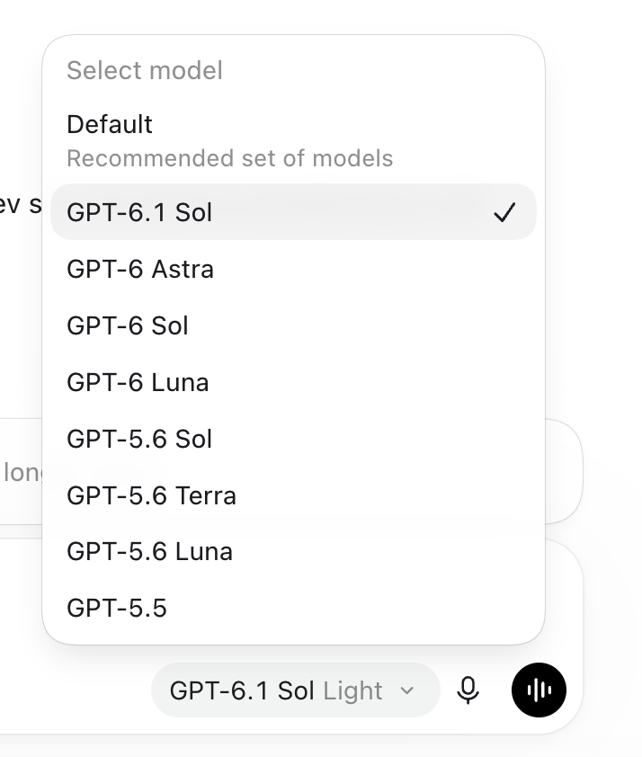

# Get ready for the masterclass

The same five steps as on the workspace page, with screenshots. Once the app is open, Codex helps with the rest.

<a href="#download-chatgpt">Step 1 · ChatGPT app</a> · <a href="#get-plus">Step 2 · Plus</a> · <a href="#add-browser">Step 3 · Chrome and extension</a> · <a href="#open-workspace">Step 4 · Starter kit in Codex</a> · <a href="#finish-setup">Step 5 · Install and check</a>

> **Work in Codex, not in a normal ChatGPT chat.** Everything in the masterclass happens in **Codex**. In the ChatGPT app, click **ChatGPT ⌄** at the top left and choose **Codex** (*Build, debug, and ship*). Step 4 shows where.

> **Which model.** For the installation, use **GPT-6.1 Sol** with **low** effort (shown as *Light*). During the workshop, stay on **GPT-6.1 Sol** or **GPT-6 Luna**. **Never choose GPT-6 Astra**: it uses up your credits far faster. Step 5 shows where to pick the model.

<section class="setup-step" aria-labelledby="download-chatgpt" markdown="1">

## Step 1 · Download the ChatGPT app {#download-chatgpt}

Choose your computer:

<a class="button" href="https://get.microsoft.com/installer/download/9PLM9XGG6VKS?cid=website_cta_psi">Windows ↓</a>
<a class="button secondary" href="https://persistent.oaistatic.com/codex-app-prod/Codex.dmg">Mac · Apple Silicon ↓</a>
<a class="button secondary" href="https://persistent.oaistatic.com/codex-app-prod/Codex-latest-x64.dmg">Mac · Intel ↓</a>

**Windows:** open the download and follow **Install**. **Mac:** open the `.dmg` and copy the app into **Home → Applications** (create that folder if needed).

Open ChatGPT and sign in. On a Mac, **Apple menu → About This Mac** tells you which chip you have.

<figure class="setup-shot"><figcaption>On the <a href="https://learn.chatgpt.com/docs/app#getting-started">download page</a>, click the arrow, then your operating system. Click any screenshot to enlarge.</figcaption></figure>
</section>

<section class="setup-step" aria-labelledby="get-plus" markdown="1">

## Step 2 · Get ChatGPT Plus {#get-plus}

<a class="button" href="https://chatgpt.com/pricing/">Purchase Plus here ↗</a>

Click **Get Plus**, sign in, and complete checkout. Already have Plus or Pro? Skip this step.

<aside class="reimbursement" markdown="1">
**Want reimbursement for one month from AI Realist?**

Email your **receipt** and **bank transfer details** (account holder, IBAN, and BIC/SWIFT if needed) to **[hello@airealist.org](mailto:hello@airealist.org?subject=Masterclass%20%E2%80%94%20ChatGPT%20Plus%20reimbursement)**.

</aside>

<figure class="setup-shot compact"><figcaption>Choose <strong>Get Plus</strong>. The price shown at your checkout applies.</figcaption></figure>
</section>

<section class="setup-step" aria-labelledby="add-browser" markdown="1">

## Step 3 · Add Chrome and the ChatGPT extension {#add-browser}

Your agent uses a browser to research, open your pages and test them. Install **Google Chrome**, then the extension for the AI app you use. Using both apps? Install both extensions.

<a class="button" href="https://www.google.com/chrome/">Get Google Chrome ↗</a>

**Mac:** open `googlechrome.dmg` and drag Chrome into **Applications**. No admin password? Drag it into **Home → Applications** instead. **Windows:** open the download and follow the steps. If your work laptop blocks Chrome, Microsoft Edge works with both extensions.

**ChatGPT and Codex:**

1. In the ChatGPT app, open **Settings → Computer Use**.
2. Select **Chrome**, then **Install**. Chrome opens the [ChatGPT extension by OpenAI](https://chromewebstore.google.com/detail/chatgpt/hehggadaopoacecdllhhajmbjkdcmajg).
3. Click **Add to Chrome** and accept the permission prompt.
4. Back in **Computer Use**, Chrome now shows **Manage**.

Chrome not listed under Computer Use? The feature can depend on rollout; Codex can still use the app's built-in browser. Tell us at the tool check.

**Claude Code or Claude Cowork** (needs a paid Claude plan: Pro, Max, Team or Enterprise):

1. Open the [Claude extension by Anthropic](https://chromewebstore.google.com/detail/claude/fcoeoabgfenejglbffodgkkbkcdhcgfn) and click **Add to Chrome**.
2. Sign in to your Claude account in the extension and pin it to the toolbar.
3. In Claude Code, type `/chrome`. When it is connected, it shows **Status: Enabled** and **Extension: Installed**.

**Check that it is on and pinned:**

1. Type `chrome://extensions` into Chrome's address bar and press **Enter**. Chrome opens this page only when you type or paste the address.
2. On the **ChatGPT** card, and on **Claude** if you installed it, the switch at the bottom right must be **blue**. Click it if it is grey.
3. Click the **puzzle-piece icon** to the right of the address bar, then click the **pin** next to ChatGPT (and Claude). Their icons now stay next to the address bar, so you can see at a glance that they are there.

The extension works in your signed-in browser and can see the sites you are logged into. If you are unsure, create a separate Chrome profile for the workshop and install the extension there.

<figure class="setup-shot" style="grid-column:1 / -1;max-width:760px;width:100%;justify-self:center"><figcaption>On <code>chrome://extensions</code> each switch is <strong>blue</strong>. Once pinned, the Claude and ChatGPT icons sit next to the puzzle-piece icon.</figcaption></figure>
</section>

<section class="setup-step" aria-labelledby="open-workspace" markdown="1">

## Step 4 · Open the starter kit in Codex {#open-workspace}

The starter kit is the folder you extracted.

1. **Unzip it:** double-click on Mac; right-click → **Extract All** on Windows.
2. At the top left of the ChatGPT app, click **ChatGPT ⌄** and choose **Codex**. Stay in Codex for the whole masterclass.
3. Open **Projects** and create a project named **Agentic AI Masterclass**.
4. Click **Add folder**, choose the extracted **agentic-ai-masterclass** folder, then click **Create project**.

<figure class="setup-shot"><figcaption>Click <strong>ChatGPT ⌄</strong> at the top left and choose <strong>Codex</strong>. ChatGPT desktop app, 5 October 2026.</figcaption></figure>
<figure class="setup-shot" style="grid-column:1 / -1;max-width:760px;width:100%;justify-self:center"><figcaption>Name your project, add the extracted folder, then click <strong>Create project</strong>.</figcaption></figure>
</section>

<section class="setup-step setup-last" aria-labelledby="finish-setup" markdown="1">

## Step 5 · Let Codex install the tools, then check {#finish-setup}

In Codex, start a **New chat** in your project. Below the message box, click the model name and choose **GPT-6.1 Sol**, then set the effort to **low** (*Light*). Do not choose GPT-6 Astra: it burns through credits.

<figure class="setup-shot" style="max-width:340px"><figcaption>Choose <strong>GPT-6.1 Sol</strong> with <strong>Light</strong> effort for the installation. Never GPT-6 Astra.</figcaption></figure>

Copy this message, paste it, and press **Send**:

Use $masterclass-setup. Check my computer and this workspace. Install or update Python 3.14.7, Node 26.10.0, Poetry and Git in my user account, without admin rights. Preserve existing work. Install the locked Python dependencies, create my local .env, run the setup check and open the preview. Then help me get the starter repository with Git.

<button class="button" type="button" data-copy="installation-prompt">Copy setup message</button>

Create a [free GitHub account](https://github.com/signup), then [get the starter repository](teamwork.md). Groups come later.

Last, check that everything is installed. In the cloned project, start a **New chat** and send:

Use $masterclass-check. Check that everything for the masterclass is installed and working, without changing anything, and tell me what still needs attention.

<button class="button" type="button" data-copy="check-prompt">Copy check message</button>

**Done when:** the check ends with **“Ready for the workshop,”** you have seen **“Your workspace is running,”** and the cloned starter repository is open in Codex.

</section>

Need help? [Troubleshooting](troubleshooting.md) · [Get the starter with Git](teamwork.md) · [Agent settings](agent-practices.md)

If your work laptop blocks installation, email [hello@airealist.org](mailto:hello@airealist.org) before the workshop.

Screenshots from OpenAI’s public pages and the desktop app, 23 September 2026. Button labels may change. <a href="https://learn.chatgpt.com/docs/projects">Project help</a>.

